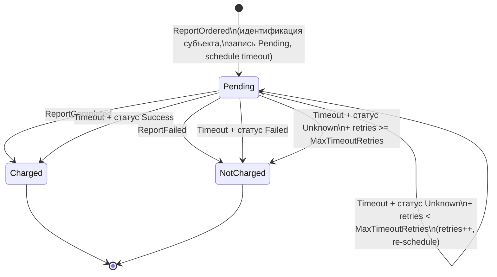

# Задание на разработку: компонент учёта бесплатных кредитных отчётов и поиска СКИ по 5791-У

| Атрибут | Значение |
|---|---|
| Статус | Draft — на уточнение системному аналитику |
| Автор | Business Analyst |
| Дата | 2026-07-02 |
| Источник требований | `task.md` + сессия уточнения требований с заказчиком |

---

## 1. Контекст и цели

### 1.1. Проблема

Субъект кредитной истории (СКИ) имеет законодательное право на ограниченное количество **бесплатных** кредитных отчётов в течение календарного года (218-ФЗ). Системе БКИ необходимо:

1. достоверно определять, **какому субъекту** выдаётся отчёт (идентификация по правилам, производным от указания 5791-У);
2. **учитывать** фактически выданные бесплатные отчёты;
3. **отвечать** внешним системам на вопрос «сколько бесплатных отчётов уже использовано этим субъектом в текущем календарном году».

### 1.2. Нормативная база

| Документ | Ссылка |
|---|---|
| 218-ФЗ «О кредитных историях» | https://normativ.kontur.ru/document/1/506681 |
| Указание Банка России 5791-У (состав запроса КО, правила поиска СКИ) | https://normativ.kontur.ru/document?moduleId=1&documentId=490474 |
| Положение Банка России 758-П (формирование кредитных историй) | https://normativ.kontur.ru/document/1/506160 |

### 1.3. Цели компонента

- **G1.** Предоставить синхронный API запроса количества использованных бесплатных отчётов субъекта за текущий календарный год.
- **G2.** Вести собственный реестр субъектов с идентификацией по детерминированным ключам поиска (упрощённый алгоритм на основе приложения 2 к 5791-У).
- **G3.** Учитывать выданные отчёты через собственную сагу, подписанную на события общей саги обработки отчёта.
- **G4.** Защититься от дублей: несколько бесплатных отчётов внутри настраиваемого cooldown-периода учитываются как один.

### 1.4. Non-goals (вне скоупа)

- Заказ кредитного отчёта в процессинге, его изготовление и предоставление клиенту.
- Оркестрация общей саги обработки отчёта (мы — только участник-наблюдатель).
- Субъекты: иностранные граждане, лица без гражданства, российские и иностранные ЮЛ (см. допущение A1).
- Принятие решения «можно/нельзя выдать бесплатный отчёт» — компонент лишь предоставляет счётчик, решение принимает вызывающая система.
- Хранение и выдача содержимого кредитных отчётов.

---

## 2. Скоуп и зафиксированные допущения

Решения приняты совместно с заказчиком в ходе уточнения требований:

| # | Допущение / решение |
|---|---|
| A1 | **Только субъекты — граждане РФ.** Ключи поиска — производные от п. 1 приложения 2 к 5791-У. Иностранцы/ЛБГ и ЮЛ — вне скоупа. |
| A2 | **Порядок силы ключей: K1 > K2 > K3 > K4 > K5 > K6** (см. § 5.2), по порядку следования наборов в 5791-У. |
| A3 | **Признак проверки ИНН игнорируется** (упрощение относительно примечания 7 к 5791-У): ключ K6 применяется всегда, когда есть оба показателя. |
| A4 | **Cooldown-группировка «цепочкой от первого»**: группа = все отчёты в пределах cooldown от ПЕРВОГО отчёта группы; следующий отчёт за пределами окна открывает новую группу (см. § 6.2). |
| A5 | **В счётчик использованных входят только отчёты в статусе `Charged` («списан»)**. Незавершённые (`Pending`) и не списанные (`NotCharged`) не учитываются. |
| A6 | **Контракты внешних систем проектируем сами и мокаем.** Транспорт сообщений — RabbitMQ. Схемы событий и статус-API — см. § 7. |
| A7 | **Календарный год и cooldown считаются в настраиваемой таймзоне**, дефолт `Europe/Moscow`. Календарный год = с 1 января 00:00 по 31 декабря 23:59:59 этой таймзоны. |
| A8 | **Момент отнесения отчёта к году** — дата/время заказа (`orderedAt` из события `ReportOrdered`). |

---

## 3. User Stories и критерии приёмки

### US-1. Запрос количества использованных бесплатных отчётов

> **Как** внешняя система (фронт заказа отчётов),
> **я хочу** передать сведения о субъекте из запроса КО и получить количество использованных им бесплатных отчётов в текущем календарном году,
> **чтобы** решить, выдавать ли очередной отчёт бесплатно.

**Acceptance criteria:**

```gherkin
Сценарий: Субъект не найден
  Дано: в БД нет субъекта, чьи ключи поиска совпадают с ключами из запроса
  Когда: поступает запрос POST /api/v1/free-reports/usage-query
  Тогда: создаётся новый субъект со всеми переданными сведениями
    И: рассчитываются и сохраняются все возможные ключи поиска
    И: ответ содержит subjectId нового субъекта и usedFreeReportsCount = 0

Сценарий: Субъект найден однозначно
  Дано: в БД есть ровно один субъект с совпадающими ключами
  Когда: поступает запрос
  Тогда: сведения субъекта дополняются данными из запроса (см. § 5.5)
    И: ключи поиска пересчитываются
    И: ответ содержит subjectId и количество использованных бесплатных
       отчётов за текущий календарный год с учётом cooldown-группировки

Сценарий: Найдено несколько субъектов
  Дано: ключам из запроса соответствуют несколько субъектов
  Когда: поступает запрос
  Тогда: выбирается субъект по правилам разрешения конфликтов (§ 5.4):
        max совпадений → сильнейший ключ → более старая запись
    И: дальнейшая обработка — как в сценарии «найден однозначно»

Сценарий: Подсчёт учитывает только списанные отчёты
  Дано: у субъекта есть отчёты в статусах Pending, Charged, NotCharged
  Когда: поступает запрос
  Тогда: в usedFreeReportsCount входят только бесплатные отчёты Charged
        текущего календарного года

Сценарий: Cooldown-схлопывание
  Дано: cooldown = 24ч; у субъекта списаны бесплатные отчёты
        в моменты T0=10:00, T0+10ч, T0+22ч, T0+30ч
  Когда: поступает запрос
  Тогда: usedFreeReportsCount = 2
        (группа 1: {10:00, +10ч, +22ч}; группа 2: {+30ч})
```

### US-2. Учёт заказанного отчёта (основной поток саги)

> **Как** компонент учёта,
> **я хочу** стартовать собственную сагу при событии «отчёт заказан» и завершать её по итогу общей саги,
> **чтобы** списывать только фактически выданные субъекту отчёты.

**Acceptance criteria:**

```gherkin
Сценарий: Старт саги учёта
  Когда: получено событие ReportOrdered (reportId, сведения о субъекте, isFree, orderedAt)
  Тогда: субъект идентифицируется по алгоритму § 5 (создание/обновление — как в US-1)
    И: внутренний subjectId сохраняется в состоянии саги
    И: создаётся запись учёта отчёта в статусе Pending
    И: планируется timeout-сообщение через SagaTimeout

Сценарий: Успех общей саги
  Дано: сага учёта в статусе Pending для reportId
  Когда: получено событие ReportCompleted (reportId)
  Тогда: отчёт учитывается как Charged («списан»), сага завершается

Сценарий: Провал общей саги
  Дано: сага учёта в статусе Pending для reportId
  Когда: получено событие ReportFailed (reportId)
  Тогда: отчёт учитывается как NotCharged («не списан»), сага завершается

Сценарий: Идемпотентность
  Когда: повторно получено любое из событий с тем же reportId
  Тогда: состояние не меняется, дубликат игнорируется
```

### US-3. Timeout саги учёта

> **Как** компонент учёта,
> **я хочу** при затянувшейся саге сверяться со статусом отчёта в основной системе,
> **чтобы** сага не зависала навсегда и отчёты не «терялись».

**Acceptance criteria:**

```gherkin
Сценарий: Timeout — статус определён
  Дано: сага учёта Pending, истёк SagaTimeout
  Когда: срабатывает timeout-сообщение
    И: запрос статуса в основную систему вернул Success (или Failed)
  Тогда: отчёт учитывается как Charged (соответственно NotCharged),
        сага завершается

Сценарий: Timeout — статус не определён, лимит не исчерпан
  Дано: сага Pending, счётчик проверок < MaxTimeoutRetries
  Когда: срабатывает timeout, статус-запрос вернул Unknown (или ошибку/недоступность)
  Тогда: счётчик проверок увеличивается на 1
    И: планируется новое timeout-сообщение через SagaTimeout
    И: сага остаётся Pending

Сценарий: Timeout — лимит исчерпан
  Дано: сага Pending, счётчик проверок >= MaxTimeoutRetries
  Когда: срабатывает timeout, статус по-прежнему не определён
  Тогда: отчёт учитывается как NotCharged, сага завершается
```

---

## 4. Модель данных (PostgreSQL / EF Core)

> Именование и типы — ориентир для системного аналитика/разработчика, допускается уточнение.

### 4.1. Субъект и персональные данные

```
subjects
  id            uuid PK
  birth_date    date        NULL      -- 0..1
  inn           varchar(12) NULL      -- 0..1, "-" на входе = отсутствие
  snils         varchar(11) NULL      -- 0..1, "-" на входе = отсутствие
  created_at    timestamptz NOT NULL  -- используется в разрешении конфликтов ("более старая запись")

subject_names                          -- множественные вхождения ФИО
  id            bigint PK
  subject_id    uuid FK -> subjects
  last_name     text NOT NULL          -- пустая строка заменяется на "-"
  first_name    text NOT NULL          -- "-" если пусто
  middle_name   text NOT NULL          -- "-" если пусто
  UNIQUE (subject_id, last_name, first_name, middle_name)

subject_documents                      -- множественные вхождения ДУЛ
  id            bigint PK
  subject_id    uuid FK -> subjects
  doc_type_code text NOT NULL          -- код вида документа
  series        text NULL
  number        text NOT NULL
  issue_date    date NULL
  UNIQUE (subject_id, doc_type_code, series, number, issue_date)
```

Примечание: различие «текущее/предыдущее» для ФИО и ДУЛ **не хранится** — субъект просто имеет наборы ФИО и ДУЛ (требование task.md).

### 4.2. Ключи поиска

```
search_keys
  id            bigint PK
  subject_id    uuid FK -> subjects (ON DELETE CASCADE)
  key_type      smallint NOT NULL     -- 1..6 (K1..K6)
  hash          bytea NOT NULL        -- sha256 нормализованной конкатенации
  UNIQUE (subject_id, key_type, hash)
  INDEX (key_type, hash)              -- основной индекс поиска
```

### 4.3. Учёт отчётов

```
report_usages
  report_id     uuid PK               -- reportId из события, естественный ключ идемпотентности
  subject_id    uuid FK -> subjects
  is_free       boolean NOT NULL
  status        smallint NOT NULL     -- 0 Pending / 1 Charged / 2 NotCharged
  ordered_at    timestamptz NOT NULL  -- из события ReportOrdered; база для года и cooldown
  finished_at   timestamptz NULL
```

### 4.4. Состояние саги

Хранится средствами Wolverine (saga storage в PostgreSQL). Минимальный состав состояния:

```
ReportAccountingSaga
  Id                uuid   -- = reportId
  SubjectId         uuid
  IsFree            bool
  OrderedAt         DateTimeOffset
  TimeoutCheckCount int    -- счётчик проверок статуса
```

---

## 5. Алгоритм идентификации субъекта

### 5.1. Редукция ключей 5791-У

Основания редукции (из task.md):

- в запросе КО нет ОГРНИП → наборы 1.9, 1.10 исключаются;
- различий «текущее/предыдущее» ФИО и ДУЛ нет → парные наборы объединяются.

### 5.2. Итоговые ключи (по убыванию силы)

| Ключ | Состав | Объединяет наборы 5791-У | Обязательные показатели |
|---|---|---|---|
| **K1** | Фамилия + Имя + Отчество + код ДУЛ + серия ДУЛ + номер ДУЛ | 1.1 + 1.2 | ФИО, ДУЛ |
| **K2** | Фамилия + дата рождения + код ДУЛ + серия ДУЛ + номер ДУЛ | 1.3 + 1.4 | фамилия, ДР, ДУЛ |
| **K3** | Серия ДУЛ + номер ДУЛ + дата выдачи ДУЛ + ИНН | 1.5 + 1.6 | ДУЛ (с датой выдачи), ИНН |
| **K4** | Серия ДУЛ + номер ДУЛ + СНИЛС | 1.7 + 1.8 | ДУЛ, СНИЛС |
| **K5** | Дата рождения + СНИЛС | 1.11 | ДР, СНИЛС |
| **K6** | Дата рождения + ИНН | 1.12 | ДР, ИНН |

Признак проверки ИНН не учитывается (допущение A3).

### 5.3. Нормализация и построение хэша

Порядок построения значения ключа (одинаков для данных субъекта в БД и для входящего запроса):

1. Каждое поле: `trim` → верхний регистр.
2. ФИО: символы латиницы, совпадающие по написанию с кириллицей (A, B, C, E, H, K, M, O, P, T, X, Y и их строчные), приводятся к кириллице (примечание 2 к 5791-У).
3. Пустые/отсутствующие компоненты ФИО (отчество и т.п.) → строка `"-"`.
4. Отсутствующая серия ДУЛ участвует в ключе как пустая строка (примечание 4 к 5791-У: отсутствие с обеих сторон = совпадение).
5. Значение `"-"` в ИНН или СНИЛС означает **отсутствие** показателя — ключи с этим показателем не рассчитываются.
6. Даты сериализуются как `yyyy-MM-dd`.
7. Поля конкатенируются в фиксированном порядке (см. § 5.2) через разделитель `|`, с префиксом типа ключа: `K1|ИВАНОВ|ИВАН|-|21|4510|123456`.
8. `hash = SHA256(UTF8(строка))`.

### 5.4. Поиск и разрешение конфликтов

1. Из входящего запроса рассчитываются **все возможные** ключи (декартово произведение по множественным ФИО × ДУЛ, где применимо; для запроса КО это пары «текущие» и «предыдущие» сведения).
2. Одним запросом в `search_keys` находятся все субъекты, у которых совпал **хотя бы один** ключ.
3. Если кандидатов несколько:
   - победитель — с **наибольшим количеством** совпавших ключей;
   - при равенстве — тот, у кого совпадения по **более сильным** ключам (сравнение отсортированных списков типов ключей лексикографически: K1 сильнее K2 и т.д.);
   - при полном равенстве — субъект с **наименьшим `created_at`** (более старая запись).
4. Если кандидатов нет — создаётся новый субъект.

### 5.5. Создание и обновление субъекта

При создании — сохраняются все переданные сведения, пересчитываются все ключи.

При обновлении найденного субъекта:

- новые ФИО и ДУЛ **добавляются** в наборы (дедупликация по UNIQUE-ограничениям); существующие не удаляются;
- дата рождения / ИНН / СНИЛС: если у субъекта показатель пуст, а в запросе есть — заполняется. Конфликт (в БД одно значение, в запросе другое) — **вопрос к системному аналитику** (см. § 10, Q1);
- после любого изменения ПДн — **полный пересчёт всех ключей поиска** субъекта (удалить и построить заново). Если какого-то показателя нет — ключи с ним не рассчитываются.

Идентификация и upsert должны быть устойчивы к конкурентным запросам по одному и тому же субъекту (транзакция + стратегия обработки конфликта уникальности; деталь — на проектирование).

---

## 6. Подсчёт использованных бесплатных отчётов

### 6.1. Выборка

В подсчёт входят записи `report_usages` субъекта, где:

- `is_free = true`;
- `status = Charged`;
- `ordered_at` попадает в текущий календарный год в таймзоне `TimeZone` (A7, A8).

### 6.2. Cooldown-группировка («цепочкой от первого», A4)

Отчёты сортируются по `ordered_at` по возрастанию, затем:

```
count = 0; groupStart = null
для каждого отчёта r:
    если groupStart == null или r.ordered_at - groupStart > CooldownPeriod:
        count += 1
        groupStart = r.ordered_at
результат: count
```

Пример (cooldown 24ч): отчёты в 10:00, 20:00, 32:00 → группы {10:00, 20:00} и {32:00} → **2**.

---

## 7. Контракты интеграции (проектируем сами, внешние системы мокаем — A6)

### 7.1. HTTP API компонента

`POST /api/v1/free-reports/usage-query`

Запрос (сведения о субъекте-физлице из запроса КО по приложению 1 к 5791-У, в объёме, нужном для ключей):

```json
{
  "lastName": "Иванов",
  "firstName": "Иван",
  "middleName": "Иванович",
  "birthDate": "1990-01-15",
  "document": { "typeCode": "21", "series": "4510", "number": "123456", "issueDate": "2010-05-20" },
  "previousName": { "lastName": "Петров", "firstName": "Иван", "middleName": "Иванович" },
  "previousDocument": { "typeCode": "21", "series": "4501", "number": "654321", "issueDate": "2004-03-01" },
  "inn": "500100732259",
  "snils": "112-233-445 95"
}
```

Обязательные поля: `lastName`, `firstName`, `document.typeCode`, `document.number`. Остальные — optional/nullable; `"-"` в `inn`/`snils` трактуется как отсутствие.

Ответ `200 OK`:

```json
{
  "subjectId": "6f1c2a9e-...",
  "usedFreeReportsCount": 2,
  "periodStart": "2026-01-01T00:00:00+03:00",
  "periodEnd": "2026-12-31T23:59:59+03:00"
}
```

Ошибки: `400` — невалидный запрос (детали в формате ProblemDetails); `500` — внутренняя ошибка.

### 7.2. Входящие события (RabbitMQ, обрабатываются Wolverine)

**`ReportOrdered`** — старт саги учёта:

```json
{
  "reportId": "uuid",
  "orderedAt": "2026-07-02T12:00:00+03:00",
  "isFree": true,
  "subject": { /* та же структура, что в 7.1 */ }
}
```

**`ReportCompleted`** — общая сага успешна, клиент оповещён о готовности:

```json
{ "reportId": "uuid", "completedAt": "..." }
```

**`ReportFailed`** — общая сага провалена:

```json
{ "reportId": "uuid", "failedAt": "...", "reason": "..." }
```

### 7.3. Мок внешней системы (проверка статуса отчёта при timeout)

`GET /reports/{reportId}/status` → `200 OK`:

```json
{ "reportId": "uuid", "status": "Success | Failed | Unknown" }
```

Недоступность/ошибка мока трактуется сагой как `Unknown`. Для разработки и тестов — мок-реализация (in-memory / WireMock / стаб-endpoint в тестовом хосте).

---

## 8. Сага учёта отчёта — диаграмма состояний



Требования:

- обработка всех событий идемпотентна по `reportId`;
- события `ReportCompleted`/`ReportFailed` для неизвестного `reportId` — логируются и подтверждаются (не «падают»); политика — вопрос Q2 (§ 10);
- timeout реализуется через scheduled messages Wolverine.

---

## 9. Нефункциональные требования

| Категория | Требование |
|---|---|
| Стек | ASP.NET Core Web API (minimal API), PostgreSQL, EF Core, Wolverine (HTTP + messaging), транспорт RabbitMQ |
| Конфигурация | `CooldownPeriod` (TimeSpan), `SagaTimeout` (TimeSpan), `MaxTimeoutRetries` (int), `TimeZone` (IANA id, дефолт `Europe/Moscow`), строки подключения PostgreSQL/RabbitMQ, base-url статус-API — всё через стандартную конфигурацию ASP.NET Core |
| Идемпотентность | По `reportId` во всех обработчиках событий |
| Целостность | Идентификация + upsert субъекта — в транзакции; устойчивость к конкурентным созданиям одного субъекта |
| Миграции | EF Core migrations, применение — на усмотрение проектирования (при старте/отдельным шагом) |
| Наблюдаемость | Структурированные логи ключевых решений (выбор субъекта при конфликте, исходы саги, timeout-ретраи) |
| Тестируемость | Внешние зависимости (статус-API) — за интерфейсом, мокаются |

---

## 10. Открытые вопросы (для системного аналитика)

| # | Вопрос | Предлагаемый дефолт |
|---|---|---|
| Q1 | Конфликт скалярных ПДн при обновлении субъекта (в БД ИНН/СНИЛС/ДР = X, в запросе = Y ≠ X): перезаписывать, игнорировать, копить историю? | Игнорировать новое значение, логировать warning |
| Q2 | `ReportCompleted`/`ReportFailed` пришли раньше `ReportOrdered` (гонка сообщений) — буферизовать или отбрасывать? | Отбрасывать с логом; полагаться на timeout-ветку, если `ReportOrdered` придёт позже |
| Q3 | Нужна ли аутентификация/авторизация HTTP API (mTLS, API-key)? | Вне скоупа первой итерации |
| Q4 | Точный перечень символов латиница↔кириллица для нормализации ФИО | Стандартная таблица визуально идентичных пар (§ 5.3 п. 2) |
| Q5 | Нужно ли в ответе API возвращать детализацию по группам отчётов (для аудита)? | Нет, только счётчик |

---

## 11. Definition of Done / тест-план

**Юнит-тесты:**

- расчёт каждого ключа K1–K6: полные данные, отсутствующие optional-показатели, `"-"` в ИНН/СНИЛС, пустая серия ДУЛ, латиница↔кириллица в ФИО;
- разрешение конфликтов: больше совпадений; равное количество + более сильный ключ; полное равенство + более старая запись;
- cooldown-группировка: пустой список, один отчёт, цепочка внутри окна, граница окна (ровно cooldown), пример из § 6.2;
- логика саги: все переходы диаграммы § 8, включая обе timeout-ветки и исчерпание `MaxTimeoutRetries`;
- фильтр подсчёта: только `is_free && Charged && текущий год` (граница года в заданной таймзоне).

**Интеграционные тесты (Testcontainers: PostgreSQL, RabbitMQ):**

- сквозной сценарий US-1: запрос → создание субъекта → повторный запрос теми же и пересекающимися данными → тот же `subjectId`;
- сквозной сценарий US-2: `ReportOrdered` → `ReportCompleted` → счётчик увеличился;
- US-3: timeout со стабом статус-API (`Success` / `Failed` / `Unknown` до исчерпания ретраев);
- идемпотентность: дубли событий не меняют состояние.

**DoD:**

- все AC US-1..US-3 покрыты автотестами и проходят;
- миграции EF Core создают схему § 4 с нуля;
- конфигурационные параметры § 9 работают без пересборки;
- README с инструкцией локального запуска (docker-compose: PostgreSQL + RabbitMQ + мок статус-API).
